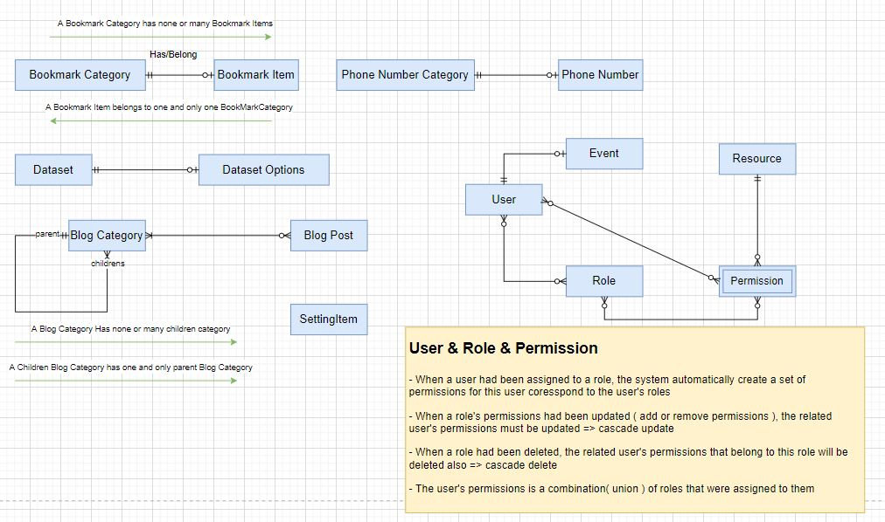

# PHASE1.JSGURU.NET - ME PORTAL

## Requirement

### Functional

> A personal portal:

- Manage Boorkmarks : with category
- Manage PhoneBook : with category
- Manage Calendar: remind important dates
- Landing Page
- Technical Blog: dev notes
- Dataset: DataType, DataName, Display Type(Table, Grid), Options.
- Be able for user to search

Users:

- Admin, Assistant
- Guess

**Notes:** Admin can adjust setting for things display on landing page

### Non functional

- REST API Standard
- Use Redux + React Hook
- Use Typescript for Landing Page
- Use Javascript for Admin Page
- Unit Test on API, Apps
- Monitoring tool : sentry.io
- Cache for blog content, bookmarks
- Authentication + Social login
- Authorization: RBAC
- DB Migration
- CI & CD on Heroku, Firebase, Netlify + Github Actions

## System Design

> Terminologies

- RBAC : Role base access control
- SPA : Single Page Application
- S3 : Simple Storage Service

> References

- Loopback

### 1.Logical/Concept View

#### 1.1 Overview

#### 1.2 System Modules

- Administration
- BookMark
- PhoneBook
- Dataset
- Blog
- Setting

#### 1.3 Integration

None

#### 1.4 Datasource

- [PHASE1-JSGURU DATA SOURCE](https://docs.google.com/spreadsheets/d/1Mhz0h6YyLXeYnlFMYmgKPvqvC5P5mWcCg368bezmaus/edit?usp=sharing)

#### 1.5 Configuration

### 2.Process View

### 3. Implementation View

### 4. Design Decisions

#### 4.1. Tech stacks

- Loopback4
- ReactJS, Material Theme
- NextJS
- PostgreSQL

#### 4.2. Backend

#### 4.3 Frontend

#### 4.5 DB Entities

**Concept Level**

#### 4.6 Infrastructure

- [Infrastructure](./images/infrastructure.jpg)

#### 4.7 Deployment Overview
